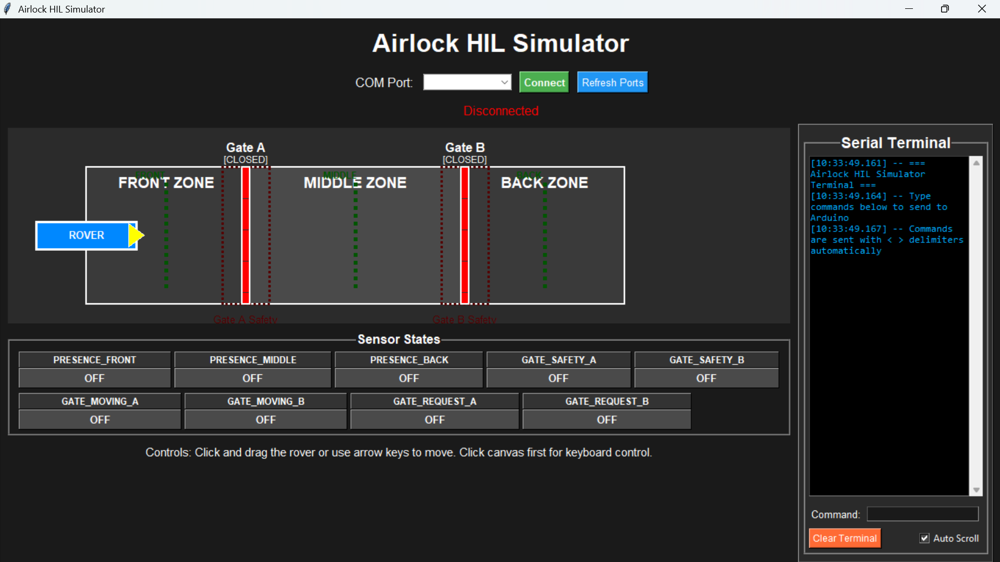
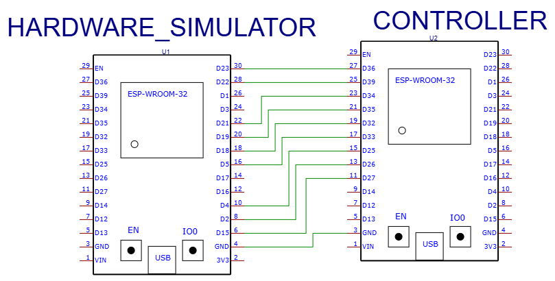

# ECC2S1 - European Rover Challenge 2025 - Airlock System

This repository contains the complete implementation for **European Rover Challenge 2025, Remote Formula, Challenge 2 - Infrastructure, Subtask 1: Airlock System**. The project includes a Hardware-in-the-Loop (HIL) simulator, firmware implementations, and comprehensive testing tools for developing and validating autonomous airlock control systems.

## 🚀 Project Overview

The airlock system is designed to safely transport a rover through a three-zone airlock with two automated gates. This implementation provides both simulation and real hardware testing capabilities for developing robust airlock control firmware for Mars rover operations.

### System Architecture

- **Three-Zone Airlock**: Front Zone → Middle Zone → Back Zone
- **Two Automated Gates**: Gate A (Front↔Middle) and Gate B (Middle↔Back)
- **Safety Systems**: Presence sensors and gate safety sensors prevent unsafe operations
- **Bidirectional Operation**: Supports rover movement in both directions
- **Real-time Communication**: Serial communication protocol for sensor data and gate commands


## 🎯 Key Features

### Airlock HIL Simulator (`airlock_gui.py`)
- **Visual Simulation**: Real-time 2D visualization of airlock zones, gates, and rover
- **Interactive Control**: Move rover using mouse drag or arrow keys
- **Sensor Simulation**: 
  - Presence sensors for each zone (FRONT, MIDDLE, BACK)
  - Gate safety sensors that trigger when rover is near gates
- **Gate Animation**: Smooth gate opening/closing animations with particle effects
- **Serial Communication**: Bidirectional communication with Arduino/ESP32
- **Safety Logic**: Gates won't close when rover is in safety zone
- **Real-time Monitoring**: Live sensor state display and serial terminal



### Arduino Control Panel (`arduino_gui.py`)
- **Manual Testing Interface**: Toggle individual sensor states
- **Real-time Feedback**: Display gate requests from Arduino
- **Serial Communication**: Send/receive formatted sensor data
- **State Visualization**: Color-coded status indicators

### Firmware Implementations

#### Control Unit (`Control_unit.ino`)
- **Basic Airlock Logic**: Simple presence-based gate control
- **Pin Definitions**: ESP32 GPIO configuration for sensors and actuators
- **Real-time Processing**: Continuous sensor reading and gate control

#### HIL ESP32 (`HIL_ESP32.ino`)
- **Hardware-in-the-Loop**: Simulates physical sensors and actuators
- **Protocol Parser**: Receives sensor states from GUI simulator
- **Gate Control**: Outputs gate requests based on internal logic
- **Serial Communication**: Formatted data exchange with Python applications

## 🛠️ Installation & Setup

### Prerequisites
- Python 3.x
- Arduino IDE or PlatformIO
- 2x ESP32 development boards (recommended: Olimex ESP32-POE)
- Serial USB cables
- Breadboard and jumper wires for HIL setup

### Python Dependencies
```bash
pip install pyserial==3.5
```

### Hardware Setup

#### HIL (Hardware-in-the-Loop) Wiring
For the HIL setup, you'll need two ESP32 boards connected as shown in `HIL_wiring.png`:



**HARDWARE_SIMULATOR (HIL_ESP32.ino)**:
- Receives sensor data from Python GUI via serial
- Outputs sensor signals on GPIO pins to simulate physical sensors
- Connected to CONTROLLER board to provide sensor inputs

**CONTROLLER (Control_unit.ino)**:
- Reads sensor inputs from HARDWARE_SIMULATOR
- Executes airlock control logic
- Outputs gate control signals back to HARDWARE_SIMULATOR

#### Firmware Installation

1. **HARDWARE_SIMULATOR Board**:
   ```bash
   # Flash HIL_ESP32.ino to the first ESP32
   # This board connects to Python GUI via USB serial
   ```

2. **CONTROLLER Board**:
   ```bash
   # Flash Control_unit.ino to the second ESP32  
   # This board contains your airlock control logic
   ```

#### Wiring Connections
Refer to `HIL_wiring.png` for detailed pin connections between the two ESP32 boards.

### Firmware Development Notes

**IO Operations are Abstracted**: 
- All GPIO operations are handled by the `processPins()` function
- **Users only need to modify the `executeLogic()` function** in `Control_unit.ino`
- The `IOpins` struct contains all sensor inputs and actuator outputs
- Focus on implementing your airlock control algorithm in `executeLogic()` - the hardware abstraction is already implemented

#### Example Logic Implementation
```cpp
void executeLogic()
{
    // Your airlock control logic goes here
    // Read from: ioPins.PRESENCE_FRONT, ioPins.PRESENCE_MIDDLE, ioPins.PRESENCE_BACK
    // Read from: ioPins.GATE_SAFETY_A, ioPins.GATE_SAFETY_B  
    // Read from: ioPins.GATE_MOVING_A, ioPins.GATE_MOVING_B
    
    // Write to: ioPins.GATE_REQUEST_A, ioPins.GATE_REQUEST_B
    
    // Example: Simple presence-based control
    if (ioPins.PRESENCE_FRONT)
        ioPins.GATE_REQUEST_A = true;
    else 
        ioPins.GATE_REQUEST_A = false;
}
```

## 🚀 Quick Start

### 1. Launch HIL Simulator
```bash
python airlock_gui.py
```

### 2. Launch Control Panel (to see status of IO)
```bash
python arduino_gui.py
```

### 3. Connect to Hardware
1. Select appropriate COM port from dropdown
2. Click "Connect" to establish serial communication
3. Use mouse or arrow keys to move rover through airlock

## 📡 Communication Protocol

### Data Format
- **To Arduino**: `<PRESENCE_FRONT:1,PRESENCE_MIDDLE:0,PRESENCE_BACK:0,GATE_SAFETY_A:0,GATE_SAFETY_B:0,GATE_MOVING_A:0,GATE_MOVING_B:0>`
- **From Arduino**: `<GATE_REQUEST_A:1,GATE_REQUEST_B:0>`

### Sensor Definitions
- **PRESENCE_FRONT/MIDDLE/BACK**: Triggered when rover center is in respective zone
- **GATE_SAFETY_A/B**: Triggered when any part of rover is near gate danger zone
- **GATE_MOVING_A/B**: Indicates gate is currently in motion
- **GATE_REQUEST_A/B**: Commands from controller to open/close gates

## 🎮 Controls & Usage

### HIL Simulator Controls
- **Mouse**: Click and drag rover to move it
- **Arrow Keys**: Use Left/Right arrows for precise movement
- **Gates**: Automatically controlled by Arduino firmware based on sensor states

### Visual Indicators
- **Green**: Active/Open/Safe
- **Red**: Inactive/Closed/Danger  
- **Yellow**: Moving/Transitioning
- **Dashed Lines**: Sensor trigger zones

## 🧪 Testing Scenarios

1. **Basic Transit**: Move rover from front to back through both gates
2. **Safety Test**: Position rover in gate safety zone and observe gate behavior
3. **Bidirectional**: Test movement in both directions
4. **Edge Cases**: Test behavior at zone boundaries
5. **Communication**: Verify serial data integrity

## 🏆 European Rover Challenge Context

This implementation is designed for **ERC 2025 Challenge 2 - Infrastructure**, specifically addressing:

- **Autonomous Airlock Operation**: Firmware must handle rover passage without human intervention
- **Safety Requirements**: Gates must never open simultaneously
- **Bi-directional Support**: System supports rover movement in both directions
- **Real-time Processing**: Sub-second response times for safety-critical operations
- **Robust Communication**: Reliable serial protocol for sensor data exchange

## 📚 Documentation

- **[AIRLOCK_README.md](AIRLOCK_README.md)**: Detailed airlock system documentation
- **[PLAN.MD](PLAN.MD)**: Development roadmap and architecture decisions
- **[TECHNICAL_HANDBOOK.md](TECHNICAL_HANDBOOK.md)**: ERC 2025 technical specifications
- **Code Comments**: Extensive inline documentation in all source files

## 🔧 Development Notes

- Threading used for smooth animations and serial communication
- Frame-rate independent gate animations
- Comprehensive error handling for serial communication


## ⚠️ Safety Considerations

- Gates never open simultaneously
- Safety sensors prevent gate closure when rover is present
- Emergency stop capabilities through serial disconnect
- Visual warnings for unsafe conditions
- Comprehensive logging for debugging

## 📜 License

Developed for European Rover Challenge 2025 competition. See competition rules for usage guidelines.

---

**Team**: NSPACE  
**Competition**: European Rover Challenge 2025 - Remote Formula  
**Challenge**: Infrastructure - Airlock System  
